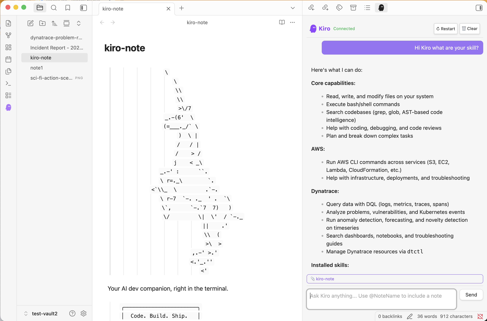

# Kiro for Obsidian

Use [Kiro CLI](https://kiro.dev) as an AI agent inside [Obsidian](https://obsidian.md) via the [Agent Client Protocol (ACP)](https://agentclientprotocol.com/).

Query Dynatrace, manage AWS, create dashboards — all from your notes.




## Features

- **Chat with Kiro** — full streaming chat panel in the Obsidian sidebar
- **Active note context** — automatically includes the current note as context (toggle in settings)
- **@mentions** — type `@NoteName` or `@"Note With Spaces"` to include specific notes
- **Image support** — paste images (Cmd+V) directly into the chat, sent via ACP
- **MCP tools** — Kiro picks up MCP servers from `~/.kiro/settings/mcp.json` (Dynatrace, AWS, etc.)
- **Skills** — Kiro loads skills from `~/.kiro/skills/` (dtctl, custom tools)
- **Branded UI** — purple Kiro ghost icon in ribbon and tab, markdown-rendered responses
- **Stop / Restart / Clear** — header buttons to cancel streaming, restart the agent, or clear chat
- **Debug mode** — toggle verbose ACP logging in settings for troubleshooting
- **Settings tab** — configure kiro-cli path, auto-include active note, debug mode

## Install

### BRAT (recommended for beta testing)

1. Install [BRAT](https://github.com/TfTHacker/obsidian42-brat) from Obsidian community plugins
2. Cmd+P → "BRAT: Add a beta plugin for testing"
3. Paste `jasonmimick-aws/obsidian-kiro` → Add Plugin
4. Settings → Community Plugins → toggle on "Kiro"

BRAT auto-updates when new releases are published.

### Manual install

1. Download `main.js`, `manifest.json`, `styles.css` from the [latest release](https://github.com/jasonmimick-aws/obsidian-kiro/releases)
2. Create `.obsidian/plugins/obsidian-kiro/` in your vault
3. Copy the three files into that folder
4. Settings → Community Plugins → toggle on "Kiro"

### Build from source

```bash
git clone https://github.com/jasonmimick-aws/obsidian-kiro.git
cd obsidian-kiro
npm install && npm run build
cp main.js manifest.json styles.css /path/to/vault/.obsidian/plugins/obsidian-kiro/
```

## Requirements

- [Kiro CLI](https://kiro.dev/downloads/) installed and on your PATH
- Obsidian 1.5.0+

## Usage

- Click the purple Kiro ghost icon in the left ribbon, or run "Open Kiro chat" from the command palette (Cmd+P)
- Type a message and press Enter or click Send
- Paste images with Cmd+V — they appear as thumbnails before sending
- Use `@NoteName` to include a specific note as context
- The active note is automatically included unless disabled in settings

## How it works

The plugin spawns `kiro-cli acp --trust-all-tools` as a subprocess and communicates over JSON-RPC (ACP protocol). Kiro picks up MCP servers and skills from `~/.kiro/settings/` — configure Dynatrace, AWS, or any MCP server once and it works here automatically.

```
Obsidian → ACP (JSON-RPC/stdio) → Kiro CLI → MCP → Dynatrace / AWS / etc.
```

## Settings

| Setting | Description | Default |
|---------|-------------|---------|
| Kiro CLI path | Full path to kiro-cli binary | Auto-detected |
| Auto-include active note | Send the current note as context with every message | On |
| Debug logging | Verbose ACP logging in developer console (Cmd+Option+I) | Off |

## Acknowledgments

This plugin was inspired by the [Obsidian Agent Client](https://github.com/RAIT-09/obsidian-agent-client) plugin, which pioneered ACP support in Obsidian. We built obsidian-kiro as a standalone implementation focused on the Kiro CLI agent with features like active note context, @mentions, and MCP integration.

## License

Apache-2.0
